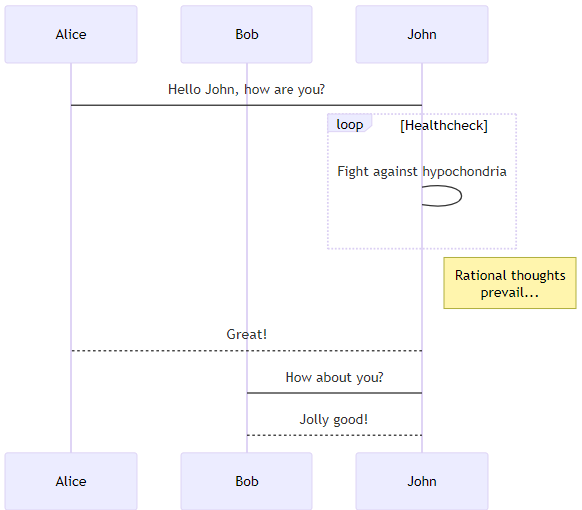

Create Django Models for the Blog API
===========================================

Before jumping into coding, it is a good idea to create some design and document it. 
The minimum required documentation for our project is a database diagram for our Blog API project.

There are many tools on the market for creating diagrams, but I believe the best way is to use diagram as code tools.
`Mermaid <https://mermaid.js.org/>`_ provides very good support for creating diagrams using code-like description. 
Mermaid also provides `Mermaid Live Editor <https://mermaid.live/>`_ - an online tool for creating diagrams.

1. Setup Sphinx for Mermaid
2. Create E-R diagram for our Blog API

Pre-requisites
++++++++++++++++++++

Requires the :doc:`custom-django-user-model` guide to be completed.

Guide code:
+++++++++++++++++

- `create-django-models <https://github.com/vancun/django-for-apis-cookbook-with-blog/tree/recipe/create-django-models>`_ branch in the GitHub `repository <https://github.com/vancun/django-for-apis-cookbook-with-blog>`_.

Setup Sphinx for Mermaid
+++++++++++++++++++++++++++

Install Sphinx extension
~~~~~~~~~~~~~~~~~~~~~~~~~~~~

Add ``sphinxcontrib-mermaid`` to the documentation dependencies in :file:`docs/requirements.txt`:

.. code-block:: text

    recommonmark
    sphinx
    sphinx-autobuild
    sphinxcontrib-mermaid

Update the project dependencies installation:

.. code-block:: bash

    pip install -U -r requirements.txt

Configure Sphinx to use the extension
~~~~~~~~~~~~~~~~~~~~~~~~~~~~~~~~~~~~~~~

Add the ``sphinxcontrib.mermaid`` extension to the list of extensions in the :file:`docs/conf.py` file:

.. code-block:: python

    extensions = [
        "recommonmark",
        "sphinxcontrib.mermaid",  # new
    ]

Create a simple diagram
~~~~~~~~~~~~~~~~~~~~~~~~~~~

Open a Sphinx document and add following content:

.. code-block:: text

    .. mermaid::

        sequenceDiagram
            participant Alice
            participant Bob
            Alice->John: Hello John, how are you?
            loop Healthcheck
                John->John: Fight against hypochondria
            end
            Note right of John: Rational thoughts  prevail...
            John-->Alice: Great!
            John->Bob: How about you?
            Bob-->John: Jolly good!

Afte building the project documentation, you should be able to see:

Create E-R diagram for our Blog API
++++++++++++++++++++++++++++++++++++++++++++

To learn more about E-R diagrams with Mermaid, go to Mermaid documentation on `Entity Relationship Diagrams <https://mermaid.js.org/syntax/entityRelationshipDiagram.html>`_.

Here is the diagram I came with:

.. mermaid::

    ---
    title: Blog API Model
    ---
    erDiagram
        Post ||--o{ Comment : "has"
        Post }o--|| User : "created by"
        Post }o--o{ Tag : has

Create Posts App
+++++++++++++++++++++++

.. code-block:: 

    python manage.py startapp posts

.. code-block:: python

    # django_project/settings.py
    INSTALLED_APPS = [
        # ..............
        # Local
        "accounts.apps.AccountsConfig",
        "posts.apps.PostsConfig", # new
    ]

Create Posts Model
+++++++++++++++++++++++

.. code-block:: python

    # posts/models.py
    from django.conf import settings
    from django.db import models

    class Post(models.Model):
        title = models.CharField(max_length=50)
        body = models.TextField()
        author = models.ForeignKey(settings.AUTH_USER_MODEL, on_delete=models.CASCADE)
        created_at = models.DateTimeField(auto_now_add=True)
        updated_at = models.DateTimeField(auto_now=True)

        def __str__(self):
            return self.title

.. code-block:: bash

    python manage.py makemigrations posts
    python manage.py migrate

.. code-block:: python

    # posts/admin.py
    from django.contrib import admin

    from .models import Post

    admin.site.register(Post)

Practice with Posts
~~~~~~~~~~~~~~~~~~~~~~~~

Let's create a user:

.. code-block:: bash

    python manage.py shell
    >>> from accounts.models import CustomUser
    >>> CustomUser.objects.create(username="ivan")
    <CustomUser: ivan>

Let's add some posts:

.. code-block:: bash

    python manage.py shell
    >>> from accounts.models import CustomUser
    >>> from posts.models import Post
    >>> u = CustomUser.objects.get(username="ivan")
    >>> Post.objects.create(title="Hello, World!", body="It's a lovely day, isn't it?", author=u)
    <Post: Hello, World!>
    >>> Post.objects.create(title="Second Post", body="This is my second post.", author=u)
    <Post: Second Post>

Create Comments Model
+++++++++++++++++++++++++++

.. code-block:: python

    # posts/models.py
    # ....
    class Comment(models.Model):
        post = models.ForeignKey(Post, on_delete=models.CASCADE, related_name="comments")
        body = models.TextField()
        author = models.ForeignKey(settings.AUTH_USER_MODEL, on_delete=models.CASCADE)
        created_at = models.DateTimeField(auto_now_add=True)
        updated_at = models.DateTimeField(auto_now=True)

        def __str__(self):
            label = truncate_with_elipsis(self.body, 50)
            return f"{self.author.username}: {label}"

.. code-block:: bash

    python manage.py makemigrations posts
    python manage.py migrate

.. code-block:: python

    # posts/admin.py
    from django.contrib import admin

    from .models import Comments, Post

    admin.site.register(Post)
    admin.site.register(Comment)

Practice with Comments
~~~~~~~~~~~~~~~~~~~~~~~~

.. code-block:: bash

    python manage.py shell
    >>> from accounts.models import CustomUser
    >>> from posts.models import Comment, Post
    >>> u = CustomUser.objects.get(username="ivan")
    >>> p = Post.objects.get(title="Second Post")
    >>> Comment.objects.create(body="comment 1", author=u,post=p)
    <Comment: ivan=comment 1>

Create Tags Model
+++++++++++++++++++++++++++++++

.. code-block:: python

    # posts/models.py
    # ....

    class Post(models.Model):
        title = models.CharField(max_length=50)
        body = models.TextField()
        author = models.ForeignKey(settings.AUTH_USER_MODEL, on_delete=models.CASCADE)
        tags = models.ManyToManyField('Tag', related_name='posts', through='PostTag')  # new
        created_at = models.DateTimeField(auto_now_add=True)
        updated_at = models.DateTimeField(auto_now=True)

        def __str__(self):
            return self.title

    # .......

    class Tag(models.Model):
        name = models.CharField(max_length=30, unique=True)

        def __str__(self):
            return self.name

    class PostTag(models.Model):
        post = models.ForeignKey(Post, on_delete=models.CASCADE)
        tag = models.ForeignKey(Tag, on_delete=models.CASCADE)

        class Meta:
            unique_together = ('post', 'tag')

The relationship between Post and Tag could be specified also without link table. In this case Django will automatically create a link table:

.. code-block:: python

    tags = models.ManyToManyField('Tag', related_name='posts')

.. code-block:: python

    # posts/admin.py
    from django.contrib import admin

    from .models import Comments, Post

    admin.site.register(Post)
    admin.site.register(Comment)
    admin.site.register(Tag) # new
    admin.site.register(PostTag) # new

.. code-block:: bash

    python manage.py makemigrations posts
    python manage.py migrate

Practice with Tags
~~~~~~~~~~~~~~~~~~~~~~~~~

.. code-block:: bash

    python manage.py shell
    >>> from posts.models import Post, Tag
    >>> t1 = Tag.objects.create(name="Tag 1")
    >>> t2 = Tag.objects.create(name="Tag 2")
    >>> p = Post.objects.get(title="Second Post")
    >>> # Tags can be assigned by instance reference
    >>> p.tags.set([t1, t2])
    >>> p.tags.all()
    <QuerySet [<Tag: Tag 1>, <Tag: Tag 2>]>
    >>> # Tags can be assigned by ID
    >>> p.tags.set([t1.id])
    <QuerySet [<Tag: Tag 1>]>
    >>> # Attempt to assign a tag multiple times is assigning it only once
    >>> p.tags.set([t1, t1]) 
    <QuerySet [<Tag: Tag 1>]>

