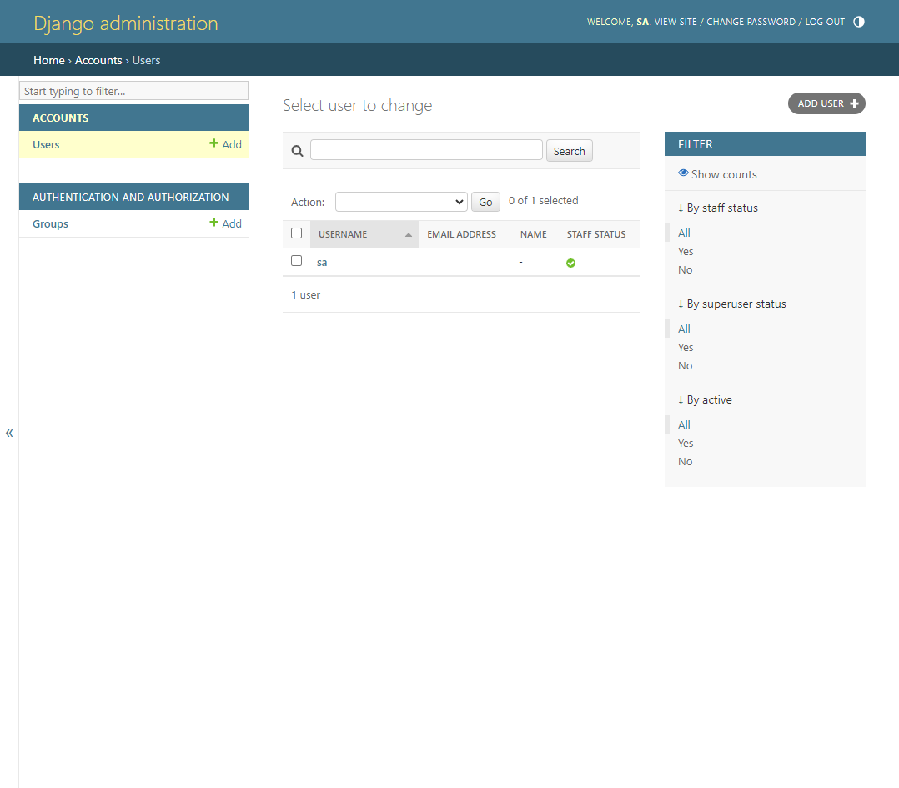

Custom Django User Model
=============================

In this guide we will perform following steps:

1. Create ``accounts`` Django Application
2. Create a user model in ``accounts`` app
3. Migrate the database
4. Register the user model in Django admin

Pre-requisites
++++++++++++++++++++

Requires the :doc:`setup-django-project` guide to be completed.

Guide code:
+++++++++++++++++

- `custom-django-user-model <https://github.com/vancun/django-for-apis-cookbook-with-blog/tree/recipe/custom-django-user-model>`_ branch in the GitHub `repository <https://github.com/vancun/django-for-apis-cookbook-with-blog>`_.

Create ``accounts`` Django Application
+++++++++++++++++++++++++++++++++++++++++

.. code-block:: bash

    # Revert admin migrations - admin will depend on accounts
    python manage.py migrate admin zero

Let's create the ``accounts`` app:

.. code-block:: bash

    python manage.py startapp accounts

We need to register the ``accounts`` app in Django settings:

.. code-block:: python

    # django_project/settings.py
    INSTALLED_APPS = [
        # .........
        # 3rd Party
        'rest_framework',
        # Local
        "accounts.apps.AccountsConfig", # new
    ]

Create the User Model
++++++++++++++++++++++++++

.. code-block:: python

    # accounts/models.py
    from django.contrib.auth.models import AbstractUser
    from django.db import models

    class CustomUser(AbstractUser):
        name = models.CharField(null=True, blank=True, max_length=100)

To tell Django to use our model for user management, we need to define a ``AUTH_USER_MODEL`` variable in Django settings:

.. code-block:: python

    # django_project/settings.py
    AUTH_USER_MODEL = "accounts.CustomUser" 

Migrate the database
+++++++++++++++++++++++++

.. code-block:: bash

    python manage.py makemigrations
    # Apply migrations
    python manage.py migrate
    # Create superuser
    python manage.py createsuperuser

Navigate the browser to the admin interface http://127.0.0.1:8000/admin/ (do not forget to start a development server first ;-) ).

The new user model is not showin in the admin interface. In order to get the user model shown in admin interface, we need to register it in admin.

Register User Model in Admin
+++++++++++++++++++++++++++++++

.. code-block:: python

    # accounts/forms.py
    from django.contrib.auth.forms import UserCreationForm, UserChangeForm
    from .models import CustomUser

    class CustomUserCreationForm(UserCreationForm):
        class Meta(UserCreationForm):
            model = CustomUser
            fields = UserCreationForm.Meta.fields + ("name",)

    class CustomUserChangeForm(UserChangeForm):
        class Meta:
            model = CustomUser
            fields = UserChangeForm.Meta.fields

We are using the default `UserCreationForm` and `UserChangeForm` classes.

.. code-block:: python

    # accounts/admin.py
    from django.contrib import admin
    from django.contrib.auth.admin import UserAdmin
    from .forms import CustomUserCreationForm, CustomUserChangeForm
    from .models import CustomUser

    class CustomUserAdmin(UserAdmin):
        add_form = CustomUserCreationForm
        form = CustomUserChangeForm
        model = CustomUser
        list_display = [
            "username",
            "email",
            "name",
            "is_staff",
        ]
        fieldsets = UserAdmin.fieldsets + ((None, {"fields": ("name",)}),)
        add_fieldsets = UserAdmin.add_fieldsets + ((None, {"fields": ("name",)}),)

    admin.site.register(CustomUser, CustomUserAdmin)

We defined `username` to be the first column in the list as it is to link to the user details. If we used `email`, the link would not be avialable in case the email is not provided.

Now user model is available in admin.

At the end of this guide the file tree should look like:

.. code-block:: text

    ├── db.sqlite3
    ├── blogapi
    │   ├── __init__.py
    │   ├── settings.py
    │   ├── urls.py
    │   ├── asgi.py
    │   └── wsgi.py
    ├── accounts
    │   ├── __init__.py
    │   ├── tests.py
    │   ├── apps.py
    │   ├── models.py
    │   ├── forms.py
    │   ├── admin.py
    │   └── views.py
    └── manage.py

