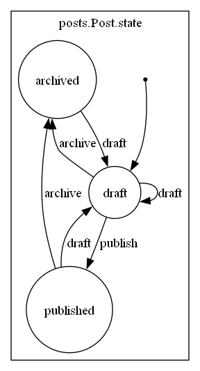

Finite State Machine (state transitions) with ``django-fsm``
==============================================================

In this guide we are going to:

- Install ``django-fsm-2`` package
- Define the blog Post worflow using the ``transition`` decorator
- Test the workflow using pytest
- Generate statechart diagram

Pre-requisites
++++++++++++++++++++

Requires the :doc:`create-blogapi-django-models` guide to be completed.

Guide code:
+++++++++++++++++

- `custom-django-user-model <https://github.com/vancun/django-for-apis-cookbook-with-blog/tree/recipe/finite-state-machine-with-django-fsm>`_ branch in the GitHub `repository <https://github.com/vancun/django-for-apis-cookbook-with-blog>`_.

Introduction
+++++++++++++++++++

Our blog posts should have state. State could be:

- DRAFT - post can be seen and modified by the author
- PUBLISHED - post can be seen by everyone
- ARCHIVED - post can be seen only by the author

Only author can change the post state.

Post could be archived from any state.
Post can be published only from draft.
Post can be made draft from any state.

Here is what the state transitions look like. The diagram has been created using django-fsm package.

Install ``django-fsm``
+++++++++++++++++++++++++++++++

Add ``django-fsm-2`` to the application dependencies (:file:`requirements.txt`):

.. code-block:: text

    -r docs/requirements.txt
    django
    django-fsm-2
    djangorestframework
    pytest
    pytest-cov
    pytest-django
    python-dotenv

Install the dependencies:

.. code-block:: bash

    pip install -U -r requirements.txt

Modify Post Model
+++++++++++++++++++++++++++++++++

Let's define our workflow using the django-fsm ``transition`` decorator:

.. code-block:: python

    # /src/posts/models.py
    from django.conf import settings
    from django.db import models
    from django_fsm import FSMField, transition

    # .........................

    class PostState(models.TextChoices):
        DRAFT = "draft"
        PUBLISHED = "published"
        ARCHIVED = "archived"

    class Post(models.Model):
        title = models.CharField(max_length=50)
        body = models.TextField()
        tags = models.ManyToManyField("Tag", related_name="posts", through="PostTag")
        author = models.ForeignKey(settings.AUTH_USER_MODEL, on_delete=models.CASCADE)
        created_at = models.DateTimeField(auto_now_add=True)
        updated_at = models.DateTimeField(auto_now=True)
        state = FSMField(default=PostState.DRAFT, choices=PostState.choices)    # new

    def can_publish(self, user):
        return self.author == user

    def can_archive(self, user):
        return self.author == user

    def can_draft(self, user):
        return self.author == user

    @transition(
        field=state,
        source=PostState.DRAFT,
        target=PostState.PUBLISHED,
        permission=can_publish,
    )
    def publish(self):
        pass

    @transition(
        field=state, source="*", target=PostState.ARCHIVED, permission=can_archive
    )
    def archive(self):
        pass

    @transition(field=state, source="*", target=PostState.DRAFT, permission=can_draft)
    def draft(self):
        pass

    def __str__(self):
        return self.title

We also defined permission checking methods and attached them to the state mutator methods, using the ``permission`` parameter
of the ``transition`` decorator.

Test the State Machine
+++++++++++++++++++++++++++++++++

To verify requirements are satisfied, write state machine tests:

.. code-block:: python

    # /src/tests/posts/test_models_state.py
    import pytest
    from posts.models import Post, PostState
    from django_fsm import has_transition_perm, TransitionNotAllowed

    pytestmark = [pytest.mark.django_db]

    class TestPostState:
        # DRAFT

        def test_should_have_draft_state_after_created(self, user):
            post = Post(author=user)
            assert post.state == PostState.DRAFT

        def test_should_permit_to_draft_from_archive_by_author(self, post, user):
            assert has_transition_perm(post.draft, user)

        def test_should_not_permit_to_draft_from_archive_by_not_author(self, post, user2):
            assert not has_transition_perm(post.draft, user2)

        def test_should_transition_to_draft_from_archived_after_draft(self, post):
            post.state = PostState.ARCHIVED
            post.save()
            post.draft()
            assert post.state == PostState.DRAFT

        # PUBLISHED

        def test_should_not_permit_publish_by_non_author(self, post, user2):
            assert not has_transition_perm(post.publish, user2)

        def test_should_not_allow_publish_from_archived_after_draft(self, post):
            post.state = PostState.ARCHIVED
            post.save()
            with pytest.raises(TransitionNotAllowed):
                post.publish()

        def test_should_allow_to_publish_by_author(self, post, user):
            assert has_transition_perm(post.publish, user)

        def test_should_transition_to_published_from_draft_after_publish(self, post):
            post.publish()
            assert post.state == PostState.PUBLISHED

        # ARCHIVED

        def test_should_not_permit_archive_by_non_author(self, post, user2):
            assert not has_transition_perm(post.archive, user2)

        def test_should_permit_archive_by_author(self, post, user):
            assert has_transition_perm(post.archive, user)

        def test_should_transition_to_archived_from_draft_after_archive(self, post):
            post.archive()
            assert post.state == PostState.ARCHIVED

        def test_should_transition_to_archived_from_published_after_archive(self, post):
            post.state = PostState.PUBLISHED
            post.archive()
            assert post.state == PostState.ARCHIVED

Generate Statechart Diagram
+++++++++++++++++++++++++++++++

First you need to install graphviz package. Update :file:`requirements.txt` and install the dependencies:

.. code-block:: text

    -r docs/requirements.txt
    django
    django-fsm-2
    djangorestframework
    graphviz
    pytest
    pytest-cov
    pytest-django
    python-dotenv

.. code-block:: bash

    pip install -U -r requirements.txt

You need to add also ``django-fsm`` to ``INSTALLED_APPS``:

.. code-block:: python

    INSTALLED_APPS = [
        "django.contrib.admin",
        "django.contrib.auth",
        "django.contrib.contenttypes",
        "django.contrib.sessions",
        "django.contrib.messages",
        "django.contrib.staticfiles",
        # 3rd Party
        "rest_framework",
        "django_fsm",     # new
        # Local
        "accounts.apps.AccountsConfig",
        "posts.apps.PostsConfig",
    ]

You also need to install (depends on your operating system) graphviz executables (see `graphviz downloads <https://graphviz.org/download/>`_ for more information):

.. code-block:: bash

    sudo apt install graphviz

Generate the image:

.. code-block:: bash

    python src/manage.py graph_transitions -o post_transitions.png posts.Post

If for some reason graphviz is not in the ``PATH``:

.. code-block:: bash

    PATH=$PATH:/path/to/graphviz/binary python src/manage.py graph_transitions -o post_transitions.png posts.Post

Here is an example of the diagram generated after following this guide:

Questions
++++++++++++++++

- When you look at the statechart diagram, you might find that there are some state transitions that are not tested by our tests. Could you find them? Write tests for them?
- Think how you could improve the tests?

Further Reading
++++++++++++++++++++++

- `django-fsm package <https://pypi.org/project/django-fsm-2/>`_
- `Finite State Machines <https://brilliant.org/wiki/finite-state-machines/>`_ article
