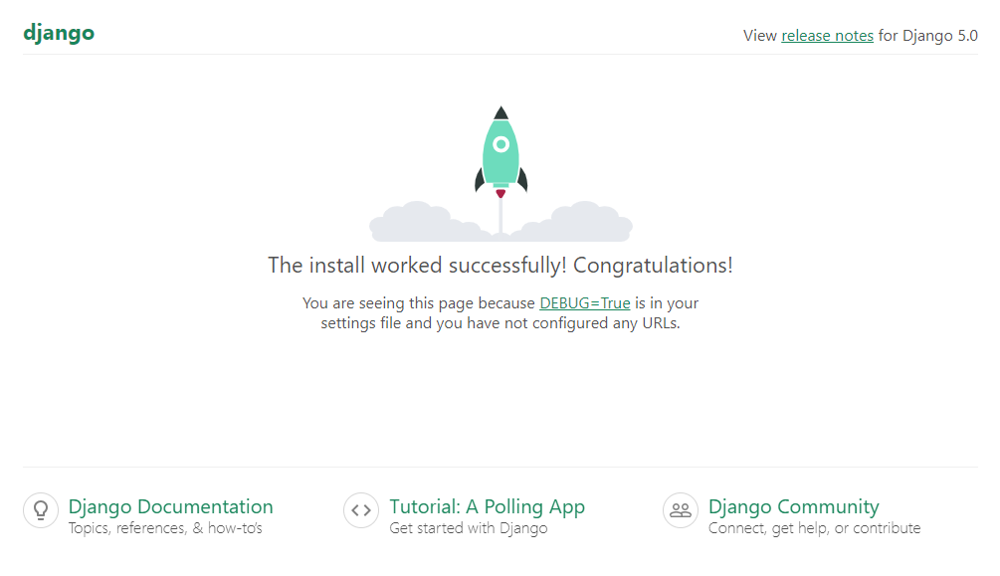

Setup a Django Project
============================

Here are the steps to perform to setup a Django project:

1. Install Django dependencies
2. Create a project directory
3. Use django-admin to start a new project
4. Run and preview the project

Pre-requisites
++++++++++++++++++++

Requires a Python project. Follow the :doc:`setup-python-project` guide to complete this.

Guide code:
+++++++++++++++++

- `setup-django-project <https://github.com/vancun/django-for-apis-cookbook-with-blog/tree/recipe/setup-django-project>`_ branch in the GitHub `repository <https://github.com/vancun/django-for-apis-cookbook-with-blog>`_.

Install Django dependencies
++++++++++++++++++++++++++++++

Add Django dependencies to :file:`requirements.txt`

.. code-block:: text

    -r docs/requirements.txt
    django
    djangorestframework
    pytest
    pytest-cov
    pytest-django
    python-dotenv

I prefer following the convention to order the dependency names alphabetically.

Install the dependencies:

.. code-block:: bash

    pip install -r requirements.txt

Create a project directory
+++++++++++++++++++++++++++

Create a directory for the project:

.. code-block:: bash

    mkdir src
    cd src

Use django-admin to start a new project
+++++++++++++++++++++++++++++++++++++++++

Make sure you are in :file:`/src/` folder and create new django project, using django-admin command:

.. code-block:: bash

    django-admin startproject blogapi .

The project files and directories should be like the following:

.. code-block:: text

    ├── src
    │   ├── blogapi
    │   │   ├── __init__.py
    │   │   ├── settings.py
    │   │   ├── urls.py
    │   │   ├── asgi.py
    │   │   └── wsgi.py
    │   └── manage.py
    ├── requirements.txt
    ├── README.md
    └── LICENSE

I have not included the :file:`docs` folder intentionally.

Run and preview the project
++++++++++++++++++++++++++++

Migrate the project database:

.. code-block:: bash

    python manage.py migrate

This will create a :file:`db.sqlite3` file in the project directory:

.. code-block:: text

    ├── src
    │   ├── db.sqlite3
    │   ├── blogapi
    │   │   ├── __init__.py
    │   │   ├── settings.py
    │   │   ├── urls.py
    │   │   ├── asgi.py
    │   │   └── wsgi.py
    │   └── manage.py
    ├── requirements.txt
    ├── README.md
    └── LICENSE

Start a Django development server:

.. code-block:: bash

    python manage.py runserver

.. code-block:: text

    Watching for file changes with StatReloader
    Performing system checks...

    System check identified no issues (0 silenced).
    August 04, 2024 - 12:00:26
    Django version 5.0.7, using settings 'blogapi.settings'
    Starting development server at http://127.0.0.1:8000/
    Quit the server with CONTROL-C.

Open a web browser window and navigate to http://127.0.0.1:8000/:

